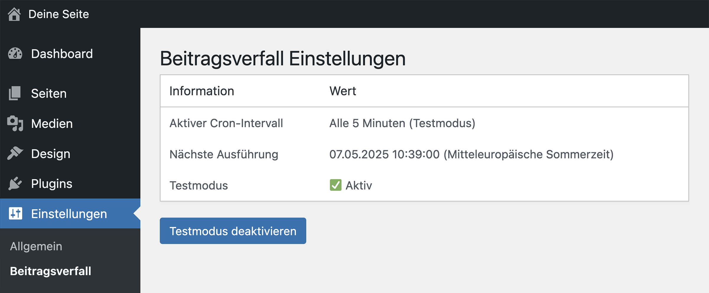

# 🗓 Beitragsverfall (WordPress Plugin)

Ein WordPress-Plugin, das Beiträge, Seiten und Custom Post Types nach einem festgelegten Verfallsdatum automatisch als **„abgelaufen“** markiert.

Ideal für zeitlich begrenzte Inhalte wie Veranstaltungen, Aktionen, Hinweise oder Kampagnen.


## Was macht das Plugin?

- Fügt allen öffentlichen Inhaltstypen ein Feld für ein **Verfallsdatum (Datum & Uhrzeit)** hinzu
- Setzt den Beitrag nach Ablauf automatisch in den Status **„abgelaufen“** (`expired`)
- Verhindert die Anzeige abgelaufener Beiträge im Frontend (für nicht eingeloggte Nutzer)
- Zeigt abgelaufene Beiträge im Backend separat an – mit eigenem Statusfilter
- Bietet eine Admin-Oberfläche mit Anzeige des Cron-Intervalls und einem **Testmodus**


## Funktionen im Überblick

- ✅ Eingabefeld für Verfallsdatum in Beitrag, Seite und CPT
- ✅ Eigener Post-Status: **„abgelaufen“** (statt z. B. „Entwurf“)
- ✅ Automatische Prüfung per WP-Cron
- ✅ Testmodus mit verkürztem Cron-Intervall (alle 5 Minuten)
- ✅ Frontend-Schutz für abgelaufene Beiträge
- ✅ Übersichtliche Darstellung im Backend
- ✅ Unterstützung für lokale Docker-Umgebungen


## Zeitsteuerung (WP-Cron)

| Modus         | Cron-Intervall | Zweck                |
|---------------|----------------|----------------------|
| **Live-Modus** | 1x pro Stunde   | Standardbetrieb      |
| **Testmodus**  | alle 5 Minuten | Für Entwicklungszwecke |

> 🐳 In Docker-Umgebungen wird `localhost` intern automatisch durch `host.docker.internal` ersetzt, damit WP-Cron korrekt funktioniert.


## Verfallsdatum im Editor


*Abbildung: Das Eingabefeld für das Verfallsdatum erscheint in der Seitenleiste des Editors – für Beiträge, Seiten und CPTs.*

## Einstellungsseite für Cron & Testmodus



*Abbildung: Im Adminbereich lässt sich der Testmodus aktivieren und das aktive Cron-Intervall einsehen.*

## Installation

1. Plugin in `wp-content/plugins/` ablegen
2. Aktivieren
3. Im Editor unter Beitrag → „Verfall“ ein Ablaufdatum festlegen

<br><br><br><br><br>
# Kurze Entwickleranleitung

Kurzanleitung zur lokalen Weiterentwicklung des Plugins.

## 1. Projekt einrichten

Lade das Plugin herunter:
Auf „Code → Download ZIP“ klicken und das Plugin entpacken.

## 2. WordPress (Docker) starten

Nutze wp-env für eine lokale WordPress-Umgebung.
Öffne ein Terminal (macOS, Linux) oder PowerShell / Git Bash (Windows):
```bash
npx @wordpress/env start
```
Das Plugin liegt dabei in wp-content/plugins/.

## 3. Abhängigkeiten installieren und entwickeln
```bash
cd /pfad/zu/deinem/plugin  #navigiere zu deinem Plugin.
npm install                #lädt benötigte Node-Modules
npm start                  # startet den Watch-Modus für /src
```
Änderungen in src/ werden automatisch nach build/ geschrieben.

## 4. Build für Live-Einsatz
```bash
npm run build
```
Erzeugt einen optimierten, produktionsfertigen Build im Ordner build/.

## 5. Welche Dateien werden benötigt?

Für den produktiven Einsatz im WordPress-Plugin-Verzeichnis werden nur die folgenden Bestandteile benötigt:

- `build/` (vom Build-Prozess generiert)
- `block.json`
- PHP-Dateien (z. B. `plugin.php`, `render.php`, etc.)
- CSS-Dateien (z. B. `style.css`, `editor.css`)
- Optional: `assets/` (z. B. für Bilder oder Icons)

Nicht erforderlich (und typischerweise ausgeschlossen):

- `node_modules/`
- `src/`
- `.git/`
- `.gitignore`
- `package.json`, `package-lock.json`
- `.editorconfig`, `.eslintrc.js` usw.

Diese Dateien sind nur für die Entwicklung relevant und sollten nicht ins produktive WordPress-Setup kopiert werden.
