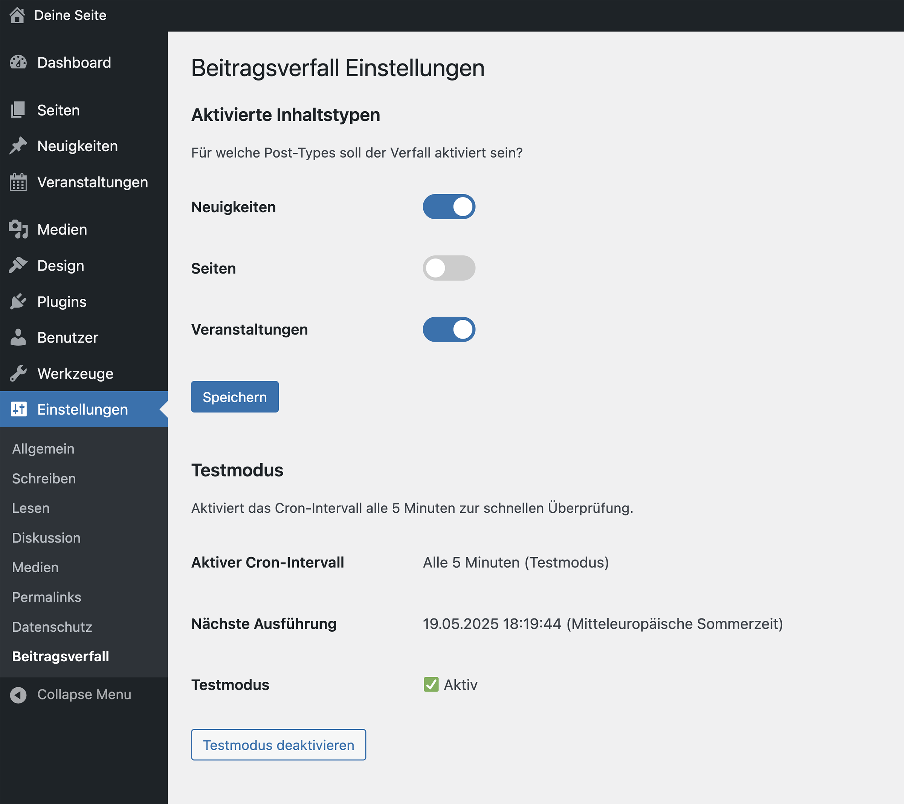

# Beitragsverfall (WordPress Plugin)

**Plugin zur zeitgesteuerten Veröffentlichung von Beiträgen, Seiten und Custom Post Types.**
Mit diesem Plugin kannst du festlegen, **wann ein Beitrag automatisch als „abgelaufen“** gilt. Ideal für zeitlich begrenzte Inhalte wie Kampagnen, Veranstaltungen oder Hinweise.

## Was macht das Plugin?

Das Plugin fügt eine **Verfallsdatum-Metabox** zu den gewünschten Inhaltstypen (Posts, Seiten, CPTs) hinzu.
Sobald das angegebene Datum erreicht ist, wird der Beitrag automatisch auf den Status **„Abgelaufen“ (expired)** gesetzt und im Frontend ausgeblendet (sofern nicht speziell behandelt).
Die Prüfung erfolgt regelmäßig über einen geplanten Cronjob.

## Funktionen im Überblick

* Eingabe eines Verfallsdatums direkt im Editor
* Automatisches Setzen des Status „Abgelaufen“ bei Erreichen des Datums
* Inhalte mit „Abgelaufen“-Status sind nicht mehr öffentlich sichtbar
* Auswahl, **für welche Beitragstypen** (Posts, Seiten, CPTs) die Funktion aktiv ist
* Option: **Testmodus** mit Prüfung alle 5 Minuten (statt stündlich)
* Unterstützt alle öffentlichen Beitragstypen mit Editor-Oberfläche
* Integration in die WordPress-Einstellungen (Einstellungsseite)

## Einstellungen

Unter **„Einstellungen → Beitragsverfall“** findest du:

* Eine Liste aller unterstützten Beitragstypen mit **Toggles zur Aktivierung**
* Eine Übersicht über den aktuellen Cron-Zeitplan
* Einen Schalter zur Aktivierung des **Testmodus** (Cron alle 5 Minuten)

## Vorschau im Editor

*Abbildung: Eingabefeld im Editor zur Festlegung eines Ablaufdatums für den Beitrag.*

### Einstellungen im Adminbereich

*Abbildung: In der Einstellungsseite können Beitragstypen aktiviert oder deaktiviert werden. Zusätzlich lässt sich ein Testmodus einschalten, um die Ablaufprüfung häufiger (alle 5 Minuten) auszuführen.*

## Installation

1. Plugin-Verzeichnis in `wp-content/plugins/` ablegen
2. Im WordPress-Backend aktivieren
3. Einstellungen unter **„Beitragsverfall“** anpassen (unter „Einstellungen“)
4. Im Editor ein Verfallsdatum setzen

---

## Plugin-Struktur (Kurzüberblick)

| Datei / Verzeichnis             | Zweck                                               |
| ------------------------------- | --------------------------------------------------- |
| `ud-plugin-beitragsverfall.php` | Einstiegspunkt des Plugins                          |
| `includes/status.php`           | Registrierung & Anzeige des Post-Status `expired`   |
| `includes/metabox.php`          | Verfallsdatum im Editor anzeigen und speichern      |
| `includes/cron.php`             | Automatische Ablaufprüfung & Cronjob-Planung        |
| `includes/settings.php`         | Einstellungsseite mit Testmodus & Post-Type-Auswahl |
| `includes/helpers.php`          | Zeitzonen- & Intervall-Hilfsfunktionen              |
